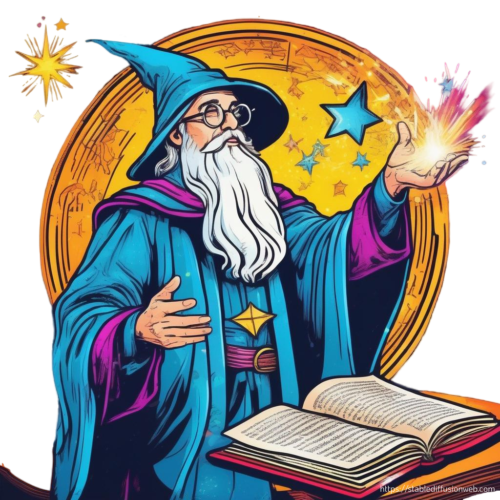
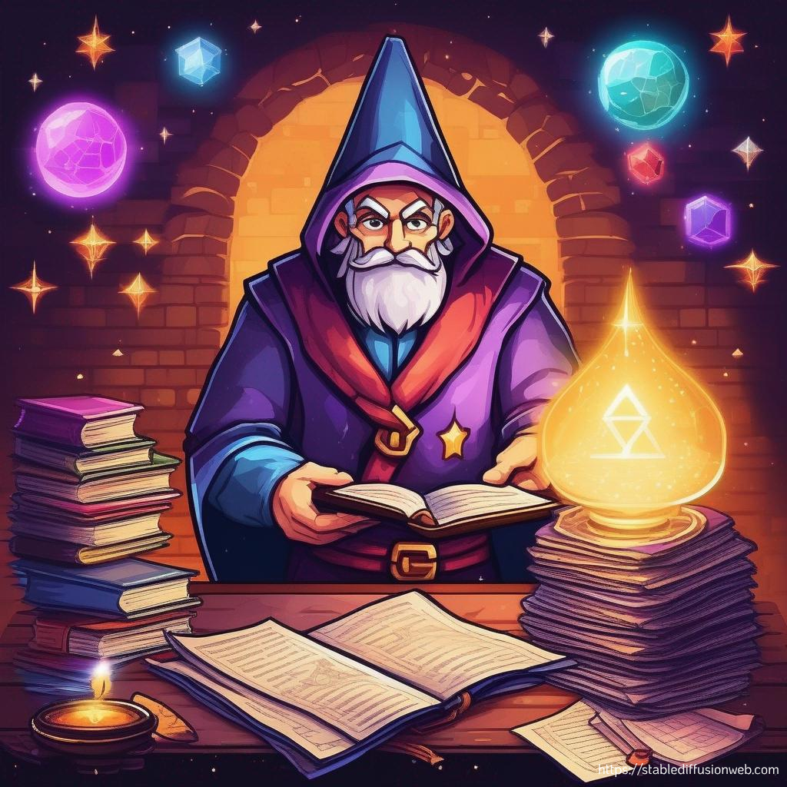

<h1 align="center" style="font-family: 'Dancing Script', cursive; color: #9933FF;">DocWhisperer  </h1>

<h4 align="center" >A Retrieval-Augmented Generation (RAG) System for PDF Chat using Qdrant Vector Database.</h4><br>

<p align="center">
  
</p>


## Overview

Imagine unlocking the hidden conversations within your dusty PDFs. DocWhisperer is your digital alchemist, transforming dry documents into vibrant dialogues. Ask anything, and DocWhisperer conjures insightful answers, pulling knowledge from the depths of your files like a magical quill. Powered by the alchemy of Qdrant's vector magic and the nimble chatbot, DocWhisperer makes them sing with meaning and ready to answer your every inquisitory whim. Step into the enchanted library of your PDFs, unleash DocWhisperer, and unlock the secrets whispered within!


## Prerequisites
* Python 3
* GPU support for LLM
* Docker

## Getting Started

### Installation
- Run Qdrant using Docker:
  ```shell
  docker run -p 6333:6333 -p 6334:6334 qdrant/qdrant:latest

  ```

- Clone this repo:

  ```shell
  git clone https://github.com/Ashish-Abraham/DocWhisperer-Qdrant.git
  cd DocWhisperer-Qdrant
  ```

- Install dependencies

  ```shell
  pip install -r requirements.txt
  ```


### Usage
 ```shell
  streamlit run app.py

 ```


## Instructions for Chatting
Follow the prompts in the app to initiate conversations and ask questions.
The chatbot will retrieve relevant information from the ingested PDFs and generate responses.

## System Workflow
<p align="center">
  
</p>


## LLM Information
* Embedding model: [all-MiniLM-L6-v2](https://huggingface.co/sentence-transformers/all-MiniLM-L6-v2)
* LLM: [BERT](https://huggingface.co/bert-large-uncased-whole-word-masking-finetuned-squad)


## Contributing
- Create a branch for your changes.
- Open a pull request.
